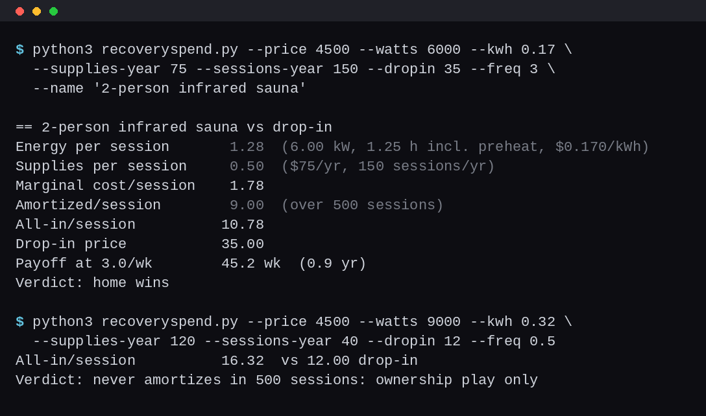

# Recoveryspend - Home recovery lab cost-per-session + break-even

A terminal calculator that answers one question: does the home unit beat
the gym-studio drop-in, and when? Costs any home recovery purchase (sauna,
cold plunge, red-light panel, massage gun, per-session amenity) against a
drop-in price, using the exact method from the HackedSelf article: true
energy draw from nameplate watts and your electric rate, filter/service
supplies per session, amortized purchase over a realistic session count,
and the weekly-frequency level where the home setup breaks even in years.

Python 3.8+, standard library only. No install, no network, nothing leaves
your machine.



## The method

- **Energy per session** = heater draw (W) / 1000 x hours x $/kWh
  (preheat counted at half draw)
- **Supplies per session** = annual filter/treatment cost / sessions per year
- **Amortized hardware** = purchase price / sessions before it's paid off,
  shown separately so you can watch it fall toward zero
- **Break even** = solve price / sessions-per-week for the frequency where
  the home marginal cost equals the drop-in price, in weeks and years

The gym comparison uses the drop-in price only. If you already pay for a
membership that includes the amenity, the drop-in is $0 and the home unit
never wins - recoveryspend tells you that plainly.

## Usage

```
$ python3 recoveryspend.py --price 4500 --watts 6000 --kwh 0.17 \
    --sessions-year 150 --dropin 35 --name "2-person infrared sauna"
== 2-person infrared sauna vs drop-in
Energy per session       5.78  (4.5 kW effective, 0.75 h, $0.170/kWh)
Supplies per session     0.50  ($75/yr filters, 150 sessions/yr)
Marginal cost/session    6.28
Drop-in price           35.00
Break even              2.6 sessions/wk  (0.7 yr)

$ python3 recoveryspend.py --json ...
{"verdict": "home wins", "marginal": 6.28, "dropin": 35.0, ...}
```

## Also check

- `--preheat 1.0` full-draw preheat hour instead of the half-draw default
- `--life-sessions 500` amortization window (default 500 sessions)
- `--supplies-year 0` no filter/treatment line
- Exit code 1 when the home unit loses at the current frequency, so the
  check can gate a purchase decision in a script

## Honest limits

Energy math is nameplate math: real duty cycles, ambient temperature and
insulation move the true number, so treat the figure as the optimistic
floor and the break-even as the optimistic edge. Sessions-per-year is a
behavioral guess only you can make; the break-even output is exactly the
place that guess gets honest. No study effect sizes are cited anywhere in
this repo, because there are none here - this tool is dollars, not dose.

## Related

The full protocol and the worked example behind this method:
https://hackedself.com/recovery/home-recovery-lab-cost-per-session/
